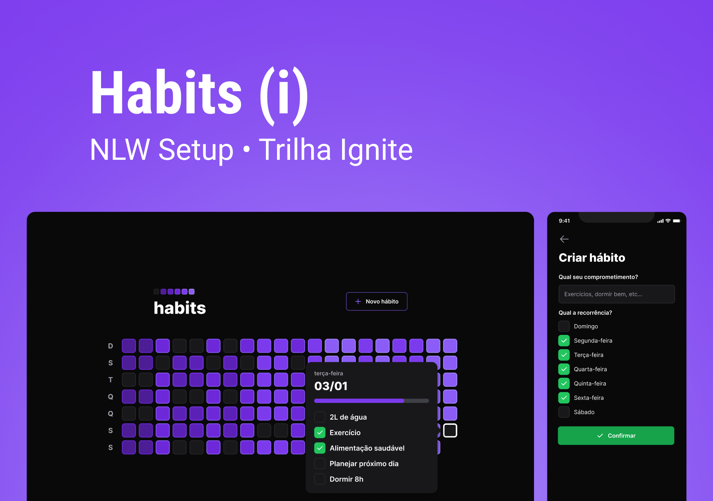

# NLW Setup



<br />

## About the project

This project has a web and mobile system to deal with the management of your daily habits.

---

## :rocket: Technologies

This project was developed with the following technologies:

- Server

  - [x] [Node.js](https://nodejs.org)
  - [x] [Fastify](https://www.fastify.io)
  - [x] [Prisma](https://www.prisma.io)
  - [x] [SQLite](https://www.sqlite.org)

- Web

  - [x] [ReactJS](https://reactjs.org)
  - [x] [Vite](https://vitejs.dev)
  - [x] [Tailwindcss](https://tailwindcss.com)
  - [x] [Radix UI](https://www.radix-ui.com)

- Mobile

  - [x] [React Native](https://reactnative.dev)
  - [x] [Expo](https://expo.dev)
  - [x] [Nativewind](https://www.nativewind.dev)

## :gear: Execute

First clone this repository:

```bash
$ git clone https://github.com/Sup3r-Us3r/nlw-setup.git
$ cd nlw-setup
```

### Server

```bash
$ cd server
$ npm i
$ npx prisma migrate dev
$ npm run dev
```

### Web

```bash
$ cd web
$ npm i
$ npm run dev
```

### Mobile

```bash
$ cd mobile
$ npm i
$ npm run dev
```

## :nail_care: Layout

You can see the web and mobile layout in Figma with this [link](https://www.figma.com/community/file/1195326661124171197).

## :memo: License

This project is under the [MIT license](./LICENSE).
